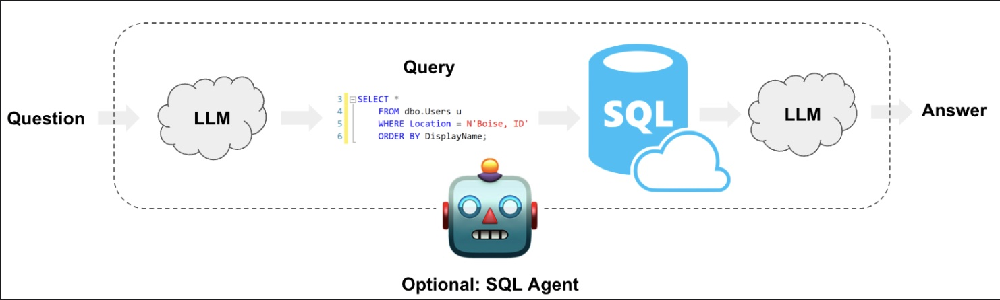

# Question-Answering-system

Enabling a LLM system to query structured data can be qualitatively different from unstructured text data. Whereas in the latter it is common to generate text that can be searched against a vector database, the approach for structured data is often for the LLM to write and execute queries in a DSL, such as SQL. In this guide we'll go over the basic ways to create a Q&A system over tabular data in databases.

## Introduction
This tutorial was made following the Lanchain Doc's guide on how to create a Question-Answering system over tabular data. The guide is available [here](https://docs.lanternai.com/docs/question-answering-system-over-tabular-data). It was done for educational purposes and to understand how to create a Q&A system over tabular data.

## Methods
There are two main methods to create a Q&A system over tabular data.

We will cover implementations using both chains and agents. These systems will allow us to ask a question about the data in a database and get back a natural language answer. The main difference between the two is that our agent can query the database in a loop as many times as it needs to answer the question.

## Architecture

At a high-level, the steps of these systems are:

1. Convert question to SQL query: Model converts user input to a SQL query.
2. Execute SQL query: Execute the query.
3. Answer the question: Model responds to user input using the query results.




## Setup:

To get started, you'll need to install the libraries in the requirements.txt file. You can do this by running:

It is recommended to use a virtual environment to install the dependencies. You can create a virtual environment by running:

```bash
python -m venv venv
```

Then, activate the virtual environment and install the dependencies:

```bash
pip install -r requirements.txt
```

## Sample data:

In this guide, we'll use a sample database `Chinook_Sqlite.sqlite` which contains tables for artists, albums, tracks, playlists, etc. You can download the database from [here](https://www.sqlitetutorial.net/sqlite-sample-database/).